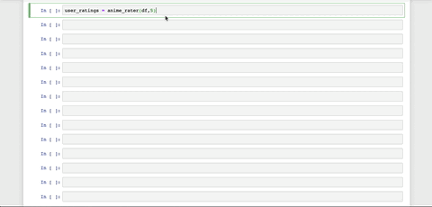

# Anim-endations

## Agenda 
- Goal 
- Data Process
- Exploratory Data Analysis
- Recommendation Models
- Conclusion
- Recommender System Finish Product

# Goal
### Our objective was to create an Anime Recommendation based on the users rating from previous shows they watched and genre preference.

# Data Process

## Data Source Available
- Anime-Planet.com
- 13,545 Anime Shows
- Multiple Users Reviewed

## Data Collected 
- 4,662 Anime Shows
- 41,018 Users Review

## Data Prep
- Username
- User Rating
- Anime Title
- Anime Show Type (TV, Web, OVA, Movies)

## Data Cleaning
- Replaced Blank reviews with 0
- Dropped Music Video Types
- Included Users who only reviewed more than 5 Animes
- Assigned **User ID** to Each **User Name**
- Assign **Title IDs** to each **Anime Show**
  

# Exploratory Data Analysis
 Question 1:

  Through the **rating system** what is the **average** ratings evenly distributed?

**Observation:**

Our graph illustrates the behavior of all users ratings
We were able to see the average rating Anime shows received which was eight

------
Question 2:

What types of Anime do users watch most?

**Observation**:

- Our graph concludes that anime TV shows were the most-watched type of anime.
TV shows are the most common form of anime.

----
Question 3:

Which animes were most popular?

**Observations:** 

- We were impressed to see Gintama was rated the best Anime Show several times with different seasons.

----
Question 4:
- What were user activities with ratings?

**Observation:**

# Recommendation Models

The Model is Prepped with:
- User ID
- Item ID
- Ratings

## Models

**Grid Search SVD**

RMSE : 1.369

# Conclusion
- Grid Search SVD worked best providing the lowest RMSE

- We were able to finish our Recommendation System that provides the best Anime Show according to Users Rating and Users genres preference.

-----
Let’s Take A Look At our Final Product

## Recommender System Final Product

Thank You!